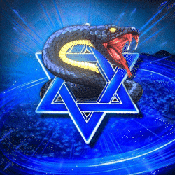

Sure, here's the updated README with additional information:

<!-- PROJECT LOGO -->
 

    

  <h3 align="center">FiveM Israel</h3>

  

    Where imagination comes to life!
     
  

<!-- ABOUT THE PROJECT -->
## About The Project

We are FiveM Israel, a project based on FiveM that allows players to join Israeli servers and experience a unique and localized version of FiveM. FiveM is a modification for the popular open-world video game, Grand Theft Auto V, that allows players to create and join custom multiplayer servers. It was developed by CitizenFX Collective and released in 2015. FiveM provides a platform for players to create their own unique experiences by modifying game mechanics, creating custom maps and scripts, and adding new vehicles and weapons.

FiveM has gained significant popularity in the gaming community and has a large following on social media platforms like Reddit and Twitter. It has also spawned various communities and groups that host their own custom servers with unique gameplay and experiences.

FiveM Israel provides a platform for Israeli gamers to connect with each other and play together in a customized environment. In addition to its gaming features, FiveM Israel also provides a ranking system that allows servers to be ranked based on their popularity and player count. This ranking system is available on Discord, a popular communication platform used by gamers.

At FiveM Israel, we strive to create a welcoming and inclusive community that fosters creativity and collaboration among gamers. Our servers are moderated to ensure fair gameplay and a positive experience for all players.

So, if you're an Israeli gamer looking for a customized and localized FiveM experience, come join us at FiveM Israel!
